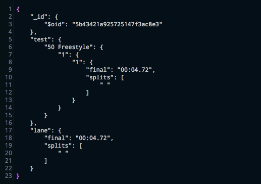
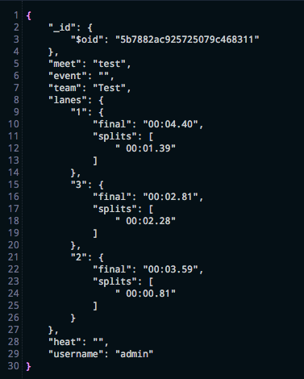

# Timing Assistant

Stream Three Project: Data Centric Development - Code Institute.  

This project was built using the Flask Microframework, and it could be used as a manual stopwatch to time multiple athletes in swimming and track. The goal of this application is to improve efficiency in sports timing by decreasing the number of people timing separately and directly storing the times, as opposed to keeping a written documentation.  

**THIS APPLICATION IS FOR EDUCATIONAL USE ONLY. THIS APPLICATION IS NOT FOR COMMERCIAL USE.**


# Live Demo

A live demo of this project can be found [here](https://timing-assistant.herokuapp.com/). This app is hosted on Heroku. The times are stored in MongoDB. 

# Technologies

1. Flask Microframework (Python)
2. Javascript 
3. jQuery
4. AJAX 
5. MongoDB (NoSQL Database)
6. Bootstrap (3.3.7)
7. HTML
8. CSS 

# UX

The idea for this Timing Assistant app came from my exposure to swimming throughout my childhood. I noticed that there needed to be a number of people involved in the timing process, as the touchpads in the pool don't always produce accurate or read-able times due to various reasons. Furthermore, the coach and the athletes can't see the final times or splits until after the meet is over, unless you have multiple people timing on deck for each lane writing times down on a clipboard. 

I saw this opportunity to create an application that would cut down on the number of people involved in the timing process, hoping to improve the efficiency of the meets and feedback to the athletes and coaches. This application could be optimised for any timed sport, and this version works with both swimming and track.

Coaches and timers alike can choose a sport, meet, event, heat, and lane numbers which all help them keep track of what's going on in a meet. It also allows them to give their athletes instant feedback after a race, since the times show up after you've saved them and then hit 'view times.' I also wanted to make sure they were able to see cumulative results for the meet, instead of just one event at a time. 

No theme was used for this design, the modern design was chosen because with a lot of timers and data on a page, it can appear messy and unorganized. I didn't want this, so while I wanted the timers, times, and event options on one page, I thought splitting the page into thirds vertically would be the best way to do this, creating a noticable difference between each third. 

# Features  

Timing Assistant was built using the Flask Microframework in Python with a NoSQL (MongoDB) database on the backend, with HTML, CSS, Javascript, and jQuery on the frontend and for the stopwatch functionality, connected to the backend with AJAX. 

On the home page of the app, the user enters the sport they wish to time for, their team name, their username, and the meet name. This action takes them to the stopwatch page, where they can then choose the event and heat that they would like to time for. The user can time up to three lanes and take splits for all three lanes. The user will have to stop the main timer manually after all three small timers are stopped, as they are set individually. This could be particularly useful, however, if the coach wanted to know how long the race went for and compare their swimmers times versus the final finisher's time. The main timer's time will not save to the database. 

Once they click "submit," the event and heat will appear. They can then start timing for up to three lanes by pressing 'START' on the main stopwatch. This will start all four stopwatches, however, only the bottom three will be saved in the database. There is the option to collect split times for each lane individually with the 'SPLIT' button. Each timer can be stopped and started individually, with the main timer controlling all stopwatches (start, stop, and reset). 

By clicking 'SAVE TIMES,' the times will be saved by using the AJAX call in the Javascript file to push the times up to Flask, with Flask connected to MongoDB. Once the times have been saved, by clicking 'VIEW TIMES,' the times will appear below the stopwatches. 

The data will also save without an event or a heat specified (these fields will be blank when times are viewed). This could be useful if a coach wanted to use the stopwatches in practice and not in a meet setting.

## Features Left to Implement 
I would like to be able to give the coaches an opportunity to download the data in a PDF or other file format. In the long run, it would allow them to keep all manual timing for their records without having to rely on handwritten data or relying on this site every time they want to go back and look at old meets. 

I would also like to allow the coach to select the number of stopwatches they want to view based on the number of athletes in each heat. Currently, you can only time for 3 athletes at a time, and you can't choose to time for less than 3. 

I would also like to implement a 'practice mode' and a 'meet mode' that would allow more sophisticated timing for meets and practices. Meet mode would create more restrictions on choosing an event or a heat, and would allow the coach to choose how many lanes they'd like to time for. Practice mode would allow the coach to make notes on times they're saving (for a specific drill, etc), while not having to specify an event or a heat.  

# Testing 
All testing for this project was done manually. The form on the landing page has required attributes on the input tags to prevent the user from not filling out a field in the form, as this will result in a 400 error, since the Flask app route depends on these inputs. 

The Ajax function and Save Times button were tested via the console and verifying that the data had appeared correctly formatted in MongoDB. The data collected from the timers and the intended data structure were also tested. 

Times saving individually with one document per lane: 


Times for lanes displaying in the same document (note: for testing purposes, only two lanes were saved here to make sure that two would show up in the same document.):



Correct Data Structure:



Testing for the stopwatches was done manually as well to make sure that the main reset button reset the stopwatch and cleared the splits from all timers, while each individual stopwatch only cleared its own time and splits. Furthermore, this was also tested for the start/stop function, as the main stopwatch controls all stopwatches, while the individual ones should only control their own start/stop functions. 

All Flask paths were also tested to make sure that all links worked and that it could handle any uncommon values in the input, and it would display inputs properly via Jinja in the HTML file. 

During the testing process, I realized that it would be possible for two users to have the same meet name or the same club name, therefore making it possible for the user to run into someone else's data. So, to view the times in the template, I have included the following to make sure that three input fields on the landing page must match up in order to display the corresponding times times. This requires the correct team name, username, and meet name to match to prevent the cross-saving or cross-viewing of times. 
```



```

The splits for each lane were originally showing up in the following format:
```
split: ["00:02.2300:01.45"]
```
However, I wanted them to appear in a list like so: 
```
split: ["00:02.23", "00:01.45"]
```
So I had to implement a list comprehension to separate this string into multiple strings in a list (if more than one split was taken for a lane) every 9 characters.

# Known Issues
In the HTML timer_page.html, the form that's sending data for the AJAX function looks like it has a stray end tag, but, the needed to encompass all of the final times, split, and lane data in order to save the times to MongoDB. Due to styling and other elements needing to be displayed, it does look like the form is out of order with the other elements. Also, looking at the HTML there are empty tags, however, this is where the split times are inserted into the HTML using jQuery. 

When saving the times, if you choose the same lane for each timer (lane 1, for example), only one of the lane 1 times will show up in view times. But, you have to choose a lane, as you cannot view the times you've saved without it due to the nature of the data structure. The lane drop-down is set to save at lane 1, land 2, and land 3 by default in case the user doesn't specify a lane. I am hoping to implement a validation that will prohibit the times from saving if the user chooses the same lane number for two lanes in a heat. 


# Credits

The Javascript functions running the stopwatch are modified from Coding with Sara's stopwatch [tutorial](https://codingwithsara.com/the-multiple-stopwatches-on-one-page-in-javascript-for-intermediates/) for this application. Some HTML was also modeled after her example, but modified to fit styling, multiple buttons, splits, and lanes. 

For the JavaScript, reset functions were modified for the reset button to reset all stopwatches instead of refreshing the page, and individual reset buttons for each small stopwatch were removed as it was an unnecessary feature for the UX of this project. Split functions were also added. Start/Stop functions were modified for a style change in buttons using jQuery. A main stopwatch was added for UX and so the coach could see the total time elapsed along with individual times, similar to a swimming scoreboard. Save Button to pass values to Flask and into MongoDB were added using Ajax. 

The Ajax function was modeled after this [post](https://stackoverflow.com/questions/37631388/how-to-get-data-in-flask-from-ajax-post) from Stack Overflow and modified to fit this project by looking at patterns of other Ajax uses and syntax. A preventDefault was added to prevent the page from reloading when the AJAX call is made. 

Recursion in Jinja was used to iterate over the nested dictionaries in Python to render the times and meet data properly by ensuring that all lanes were looped through and displayed. This [method](https://stackoverflow.com/questions/21006574/flask-jinja2-iterating-over-nested-dictionaries/21006895) from Stack Overflow was followed as a guideline, and modified for the nature of my data structure. 

# Refactoring

The javascript function for the stopwatches was attempted to be refactored so that the user could decide how many stopwatches they wanted displayed on the screen based on the number of lanes chosen. 

```javascript
var stopwatches = [];
    var i; 
    for (i=0; i<=1; i++) {
        var stopwatch = new timing("timerLabel" + i, "start" + i, "splitLabel" + i);
        stopwatches.push(stopwatch);
        console.log(i);
        document.getElementById("start" + i).onclick = function() {
            stopwatches[i].start();
        }
        
        document.getElementById("reset" + i).onclick = function() {
            stopwatches[i].reset();
        }
    
        document.getElementById("split" + i).onclick = function() {
            stopwatches[i].split();
        }
        console.log(stopwatches);
    }
 ```   

When trying to write these in a for loop like this, the stopwatches[i].start() would not read ```i``` as a variable that could change, however, when it was hard coded, there was no issue: 
    
```javascript
    document.getElementById("reset" + i).onclick = function() {
        stopwatches[0].reset();
    }

    document.getElementById("split" + i).onclick = function() {
        stopwatches[0].split();
    }
```

I tried to approach it a different way, which involved if statements to get the corresponding stopwatches to appear. 

Attempted to pass the ```i``` through a function instead as an argument taken from the for loop above, but was unsuccessful: 

```javascript
function chooseNumberOfStopwatches(i) {
    if (i == 1) {
        stopwatches_one.start();
    } 
    else if (i == 2) {
        stopwatches_one.start();
        stopwatches_two.start();
    } else {
        console.log('else');
    }
}
```

# Installation 
If you're interested in cloning this repository, to set up and install everything in the requirements.txt run the following command in the terminal: 
```
$ sudo pip3 -r install requirements.txt
```

Please note that I used Cloud9 for this project, so if you are using a different editor, the terminal commands may differ. Please consult the docs for the editor you're using for further information on editor-specific terminal commands. All secret keys for MongoDB will need to be obtained individually, as they are hidden and specific to me. 